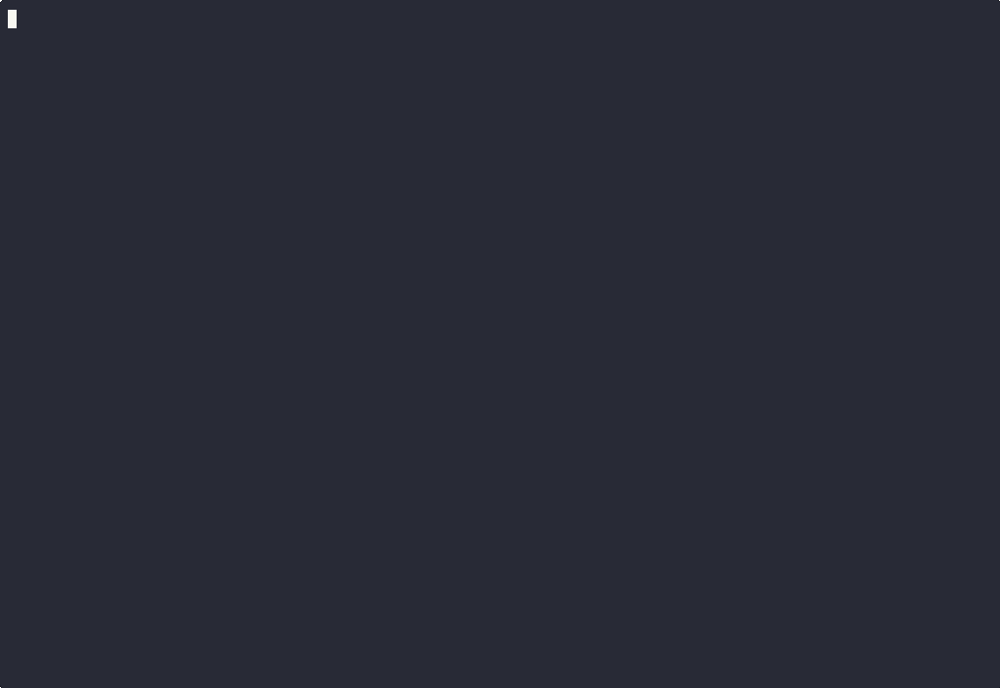

# why

[](https://github.com/jamesbrink/why/actions/workflows/ci.yml)
[](https://www.rust-lang.org/)
[](https://nixos.org/)
[](LICENSE)
[](https://github.com/QwenLM/Qwen2.5-Coder)

Simple CLI to explain errors using an embedded LLM, so you don't lose your shit.

No API keys. No internet. No patience required.

<p align="center">
  
</p>

## Quick Start

```bash
# Install it (one command, no wizardry required)
curl -sSfL https://raw.githubusercontent.com/jamesbrink/why/main/install.sh | sh

# Now yell at your errors
why "segmentation fault"
```

Already have Nix? You can skip the install entirely:
```bash
nix run github:jamesbrink/why -- "segmentation fault"
```

## Usage

<p align="center">
  
</p>

```bash
# Direct error
why "segmentation fault"

# Pipe your failures (use 2>&1 to capture stderr)
cargo build 2>&1 | why
python script.py 2>&1 | why

# For the robots
why --json "null pointer exception"
```

See the [examples/](examples/) directory for sample scripts in various languages that produce common errors.

## Features

- **Single binary** - Model embedded right in the executable. One file, zero dependencies.
- **Offline** - Works on airplanes, in bunkers, or when your ISP decides to take a nap.
- **Fast** - Local inference with Metal (macOS) or Vulkan (Linux). CPU-only works everywhere.
- **Structured output** - Clean, colored terminal output or JSON for scripting.
- **Shell completions** - Tab completion for bash, zsh, fish, and friends.

## Installation

### Quick Install (Recommended)

```bash
curl -sSfL https://raw.githubusercontent.com/jamesbrink/why/main/install.sh | sh
```

This downloads the latest release binary (~680MB, includes the model) and installs it to `~/.local/bin` or `/usr/local/bin`.

**Options:**
```bash
# Install to a specific directory
WHY_INSTALL_DIR=/opt/bin curl -sSfL https://raw.githubusercontent.com/jamesbrink/why/main/install.sh | sh

# Install a specific version
WHY_VERSION=v0.1.0 curl -sSfL https://raw.githubusercontent.com/jamesbrink/why/main/install.sh | sh
```

### Pre-built Binary (Manual)

Download the binary for your platform from [Releases](https://github.com/jamesbrink/why/releases):
- `why-x86_64-linux` - Linux (x86_64)
- `why-aarch64-darwin` - macOS (Apple Silicon)
- `why-x86_64-darwin` - macOS (Intel)

```bash
# Example for Linux x86_64
curl -L -o why https://github.com/jamesbrink/why/releases/latest/download/why-x86_64-linux
chmod +x why
sudo mv why /usr/local/bin/
```

### Build from Source

Requires [Nix](https://nixos.org/) with flakes enabled.

On Linux, the flake enables Vulkan GPU acceleration by default (works on NVIDIA/AMD/Intel). CPU-only still works without Vulkan. On macOS, it uses Metal.

```bash
git clone https://github.com/jamesbrink/why.git
cd why

# Build embedded binary (~680MB with model)
nix build
./result/bin/why "segmentation fault"
```

## Uninstall

```bash
# Remove the binary
rm $(which why)

# Or if you used the installer with default paths
rm ~/.local/bin/why
# or
sudo rm /usr/local/bin/why
```

## Shell Completions

Because typing is hard.

```bash
# Bash
why --completions bash > ~/.local/share/bash-completion/completions/why

# Zsh
why --completions zsh > ~/.zfunc/_why

# Fish
why --completions fish > ~/.config/fish/completions/why.fish
```

## Nix Build Targets

```bash
# Build embedded binary (~680MB with model)
nix build

# Run directly
nix run . -- "segmentation fault"
```

## NixOS / Home Manager

Add the overlay to your flake:

```nix
{
  inputs.why.url = "github:jamesbrink/why";

  outputs = { nixpkgs, why, ... }: {
    # NixOS
    nixosConfigurations.myhost = nixpkgs.lib.nixosSystem {
      modules = [{
        nixpkgs.overlays = [ why.overlays.default ];
        environment.systemPackages = [ pkgs.why ];
      }];
    };

    # Home Manager (standalone)
    homeConfigurations.myuser = home-manager.lib.homeManagerConfiguration {
      modules = [{
        nixpkgs.overlays = [ why.overlays.default ];
        home.packages = [ pkgs.why ];
      }];
    };
  };
}
```

## Development

```bash
nix develop

build                    # Build + embed model (auto-downloads if needed)
cargo build              # Build CLI only
cargo test               # Run tests
cargo clippy             # Lint
cargo tarpaulin          # Coverage report
```

### Manual Model Download

The `build` command auto-downloads the model, but you can also download it manually:

```bash
curl -L -o qwen2.5-coder-0.5b-instruct-q8_0.gguf \
  https://huggingface.co/Qwen/Qwen2.5-Coder-0.5B-Instruct-GGUF/resolve/main/qwen2.5-coder-0.5b-instruct-q8_0.gguf
```

## How It Works

1. You give it an error message
2. A tiny LLM (Qwen2.5-Coder 0.5B) thinks about it locally
3. You get a summary, explanation, and suggestion
4. You feel slightly less like throwing your laptop

The model is embedded directly in the binary using a custom trailer format. On first run, it extracts to a temp file for inference. Subsequent runs skip extraction.

## License

This project is licensed under the [MIT License](LICENSE).

### Model

Uses [Qwen2.5-Coder 0.5B](https://huggingface.co/Qwen/Qwen2.5-Coder-0.5B-Instruct-GGUF) (Q8_0 quantization, ~676MB) fetched from HuggingFace during build.

This project uses [Qwen2.5-Coder](https://github.com/QwenLM/Qwen2.5-Coder) by the Qwen Team (Alibaba Group), licensed under the [Apache License 2.0](https://www.apache.org/licenses/LICENSE-2.0).

When distributing binaries with an embedded model, both licenses apply:

- The `why` CLI code: MIT License
- The Qwen2.5-Coder model: Apache License 2.0
